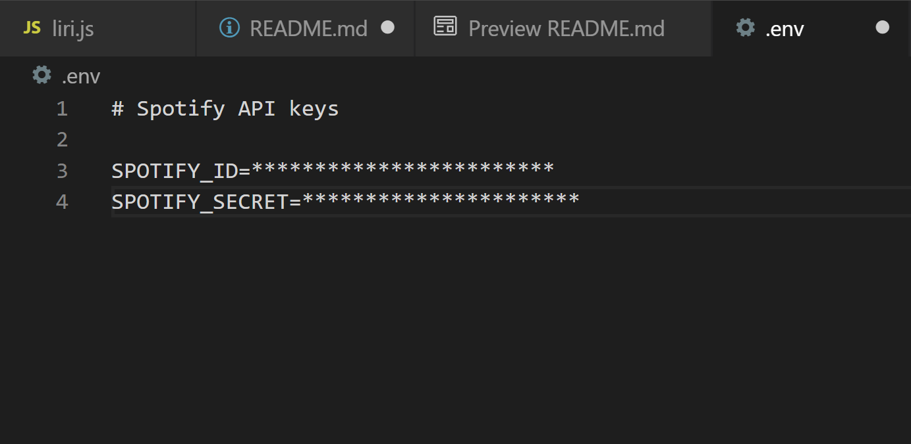

# LIRI

LIRI is a SIRI inspired bot that pulls data from multiple libraries and provides it to the user based on their command and input. While SIRI interprets voice commands, LIRI interprets text provided by the user in the node terminal. Unfortunately this application cannot be deployed for easy access and requires a bit of set up on the users end. The following notes will guide users in the right direction towards successfully running this application.

# How to use it
*<strong>Pre-steps</strong>*

(since this app uses the node-spotify-api package, users must sign up for their own spotify account and developer account (two separate accounts) and input their developer credentials in a hidden .env file before running this application. The steps are listed below)

<ol>
  <li>Visit https://developer.spotify.com/my-applications/#!/
  <li>Either login to your existing Spotify account or create a new one (a free account is fine) and log in.
  <li>Once logged in, navigate to https://developer.spotify.com/my-applications/#!/applications/create to register a new application to be used with the Spotify API. You can fill in whatever you'd like for these fields. When finished, click the "complete" button.
  <li>On the next screen, scroll down to where you see your client id and client secret.
  <li>Clone this repository if you have not already done it.
  <li>You will then need to create your own .env file within the application and include your developer credentials. replace asterisks in the image below with your own credentials.
  <li>You will also need to run "npm i" without the quotes in the node terminal to install the required packages to properly run this app.
</ol>

## LIRI in action

Once the pre-steps have been taken care of, open up the terminal and have fun with the application!

LIRI can take in one of four commands in the node terminal:

*
(The following images show how to input the commands in the command line and the information that will be displayed)
*
1. **concert-this** 
  
  
2. **spotify-this-song**
  * (see Gif above)

3. **movie-this** 
  
  
4. **do-what-it-says** 
  
  
This command is set to read the command defined in the random.txt file. By changing the command name and the arist/movie/song, the user can change what this command will output.

# Bonus

The GIF below demonstrates the bonus challenge. When the movie command is called, the data is populated in the terminal while also logging the information in the log.txt file.

# Technologies
* node.js
* packages:
  * axios
  * dontenv
  * moment
  * node-spotify-api
* fs module
* functions/methods
  * require();
  * switch statement
  * if statements
  * .appendFile();
  * .slice()/.join()
  * .catch()
